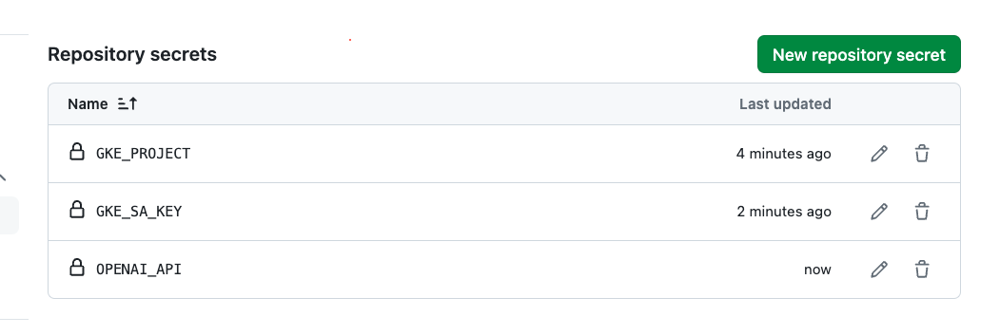

# Help on FAST API

```
pip install "fastapi[all]"

uvicorn main:app --reload
```

# Test with Postman

URL - http://127.0.0.1:80/response
(POST)

```json
{
  "text": "Who is the hero of the story"
}

```

# Docker Commands

```
docker build -t chatgpt-project1 .
docker run -d -p 8080:80 chatgpt-project1
docker tag chatgpt-project1 yourusername/chatgpt-project1
docker push yourusername/chatgpt-project1
```

# Kubernetes Code

```
kubectl create secret generic openai-secret --from-literal=API_KEY=<api-key>
```

# Important Code for Docker

```
docker buildx build --platform=linux/amd64 -t yourusername/chatgpt-project:v3 .
docker push yourusername/chatgpt-project:v3
```

